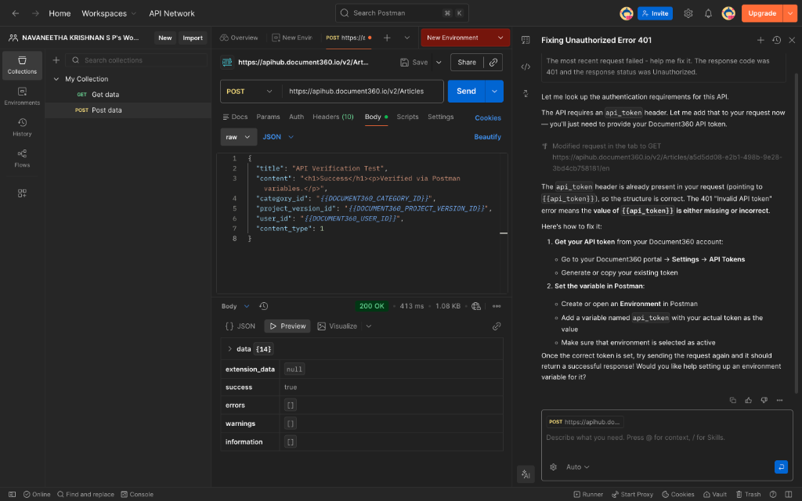

# Word Document to Document360 Migration Tool

## Project Objective
This application automates the migration of structured content from Microsoft Word (`.docx`) documents to the Document360 knowledge base platform. It ensures that semantic structures such as headings, lists, and tables are preserved during the transition.

## Key Features
- **Semantic Extraction**: Converts Word documents into clean, structured HTML.
- **Minimalist Aesthetic**: Features a clean, black-and-white minimalist UI for maximum focus.
- **API Integration**: Direct synchronization with Document360 via the Article Creation API.
- **Download Functionality**: Instantly save the generated HTML locally or to the project root.

## Technical Stack
- **Language**: Python 3
- **Framework**: Flask
- **Core Libraries**:
    - `mammoth`: For semantic Word-to-HTML conversion.
    - `requests`: For API interaction.
    - `python-dotenv`: For secure configuration management.
- **Frontend**: Vanilla HTML5, CSS3 (Glassmorphism), and JavaScript.

## How It Works
1. **Parsing**: The tool reads the `.docx` file and maps Word styles to standard HTML5 tags (`<h1>`, `<h2>`, `<p>`, `<ul>`, etc.).
2. **Migration**: It constructs a JSON payload containing the HTML content and sends it to the Document360 POST `/v2/Articles` endpoint.
3. **Verification**: The API response is logged and verified using both the internal dashboard and external tools like Postman.

## Setup Instructions

### 1. Environment Configuration
Create a `.env` file in the root directory with the following variables:
```env
DOCUMENT360_API_TOKEN=your_api_token
DOCUMENT360_USER_ID=your_user_id
DOCUMENT360_PROJECT_VERSION_ID=your_version_id
DOCUMENT360_CATEGORY_ID=your_category_id
```

### 2. Install Dependencies
```bash
pip install -r requirements.txt
```

### 3. Run the Application
**Option A: Web Dashboard**
```bash
python app.py
```
Open `http://localhost:5001` in your browser.

**Option B: CLI Migration**
```bash
python migrate.py <path_to_docx>
```

## API Verification (Postman)
To verify the migration independently using Postman:
1. **Endpoint**: `POST https://apihub.document360.io/v2/Articles`
2. **Headers**:
   - `api_token`: Your Document360 API Key
   - `Content-Type`: `application/json`
3. **Result**: A successful response returns `201 Created` or `200 OK` with `{"success": true}`.



## Structural Mapping Table
| Word Element | HTML Equivalent | Purpose |
|--------------|-----------------|---------|
| Heading 1    | `<h1>`          | Main topic title |
| Heading 2    | `<h2>`          | Section sub-headers |
| Paragraph    | `<p>`           | Standard text content |
| Bullet List  | `<ul><li>`      | Unordered points |
| Numbered List| `<ol><li>`      | Sequential steps |
| Table        | `<table>`       | Tabular data |
| Hyperlink    | `<a>`           | Navigational links |
